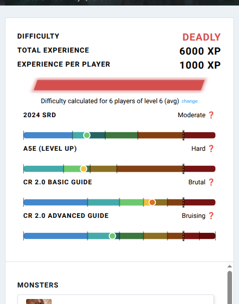

# ddb-encounter-alt-difficulty

A userscript that adds **additional encounter difficulty calculations** to the
[D&D Beyond encounter builder](https://www.dndbeyond.com/my-encounters). DDB's
encounter builder currently uses only the 2014 DMG rules; this script adds
5.5e (2024), A5E, and CR 2.0 systems.

## Install

1. Install [Tampermonkey](https://www.tampermonkey.net/) (or
   [Violentmonkey](https://violentmonkey.github.io/))
2. Install the userscript from [Greasy Fork](https://greasyfork.org/en/scripts/577224-dnd-beyond-alt-encounter-difficulty)
3. Visit any encounter under `https://www.dndbeyond.com/my-encounters` — an
   alternative difficulty badge appears next to the existing readout.

## Difficulty systems

The script displays difficulty ratings from four systems in a table-like view:
one row per system, each with a system name, a color-coded difficulty label,
and an SVG bar showing where the encounter falls on that system's scale.

| Row | System | Source | Input | Tiers |
|-----|--------|--------|-------|-------|
| 1 | **5.5e (2024 DMG)** | SRD 5.2 pp. 202–203 | raw XP (no multiplier) | Low / Moderate / High |
| 2 | **A5E** | *Level Up: Advanced 5E* (EN Publishing) | sum of monster CRs vs. total party level | Easy / Medium / Hard / Deadly / Impossible |
| 3 | **CR 2.0 (Basic)** | DragnaCarta (*Curse of Strahd: Reloaded*) | monster Power vs. party Power | Trivial / Mild / Bruising / Bloody / Brutal / Oppressive |
| 4 | **CR 2.0 (Advanced)** | DragnaCarta (*Curse of Strahd: Reloaded*) | monster Power vs. party Power (tier-dependent) | Trivial / Mild / Bruising / Bloody / Brutal / Oppressive / Overwhelming / Crushing / Devastating / Impossible |

### System details

**5.5e (2024)** — XP budget per character (SRD 5.2 pp. 202–203). No multiplier.
Three named budget tiers (Low / Moderate / High); encounters above the High
budget are unlabeled in the official rules.

**A5E** — Encounter CR (sum of all monster CRs) compared to total party level
(sum of all PC levels). Difficulty thresholds are exact fractions of total
party level: Easy ≥ 1/6, Medium ≥ 1/3, Hard ≥ 1/2, Deadly ≥ 2/3,
Impossible ≥ 1×. Below Easy is unlabeled. Elite monsters count double.

**CR 2.0 (Basic)** (DragnaCarta) — Each PC and monster has a Power value from a
flat table keyed to level/CR. Encounter difficulty is the ratio of total
monster Power to total party Power, compared against thresholds: Trivial,
Mild ≤ 0.40×, Bruising ≤ 0.60×, Bloody ≤ 0.75×, Brutal ≤ 0.90×, Oppressive ≤
1.00×.

**CR 2.0 (Advanced)** (DragnaCarta) — Similar to Basic, but uses tier-dependent
monster Power (based on average party level) and extends the scale with
additional difficulty tiers above Oppressive: Overwhelming ≤ 1.10×, Crushing ≤
1.30×, Devastating ≤ 1.60×, Impossible ≤ 2.25×.

## Sources

**5.5e (2024):** "Combat Encounters," *System Reference Document 5.2* ("SRD
5.2"), pp. 202–203. Wizards of the Coast LLC,
<https://www.dndbeyond.com/srd>, [CC-BY-4.0](https://creativecommons.org/licenses/by/4.0/legalcode).

**A5E:** "Designing Encounters," *Level Up: Advanced 5th Edition* ("A5E"),
EN Publishing. Rules reference at <https://a5e.tools/rules/designing-encounters>.

**CR 2.0:** DragnaCarta, *Challenge Ratings 2.0*,
<https://www.gmbinder.com/share/-N4m46K77hpMVnh7upYa>.
Web calculator: <https://www.challengerated.com>.

